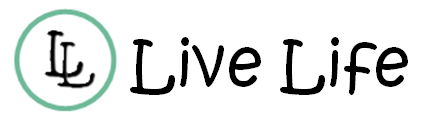

# Live Life

Welcome to the **[Live Life](https://live-life-897b359a6b34.herokuapp.com/)** a platform where people can share what their up to, share their experience of going out into the world. User can upload images for other to view or can upload images to their private folder called My Adventures for the use. 


[Link, to live project](https://live-life-897b359a6b34.herokuapp.com/)

[Link, to DRF-API READme project](https://github.com/PdoyleC/live-life-api/blob/main/README.md)

**Purpose of the site**
- This site is a blog style site, aimed at people to share what their up to, going for a walk, having a picnic, etc.
- Upload images.
- View other users images.


# Table of Contents

- [Table of Contents](#table-of-contents)
   * [UX](#ux)
      + [Site Purpose:](#site-purpose)
      + [Site Goal:](#site-goal)
      + [Audience:](#audience)
      + [Communication:](#communication)
      + [Current User Goals:](#current-user-goals)
      + [New User Goals:](#new-user-goals)
      + [Future Goals:](#future-goals)
   * [User Stories](#user-stories)
   * [User Experience](#user-experience)
      + [Agile](#agile)
   * [Design](#design)
      + [Wireframes](#wireframes)
      + [Logo:](#logo)
      + [Colour Scheme:](#colour-scheme)
      + [Database schema](#database-schema)
   * [Testing](#testing)
   * [Deployment](#deployment)
      + [Heroku](#heroku)
      + [Connecting to the API:](#connecting-to-the-api)
   * [API error and feedback](#api-error-and-feedback)
   * [Issues](#issues)
   * [Credits](#credits)


## UX

### Site Purpose:
This site is a blog style site, aimed at people to share what their up to, going for a walk, having a picnic, etc.

### Site Goal:
Users to upload images, for the group. Users can upload images for themselves to view, create a list for there next trip so the user doesn't forget anything.

### Audience:
Anyone who enjoys going out and about and wants to share what there up to.

### Communication:
The social network-style layout presents posts from different users, allowing interaction between them through likes, comments and following your favorite users.

### Current User Goals:
Create new posts regularly, Create there own adventure area for there own privite viewing, Create a item list for there next adventure.

### New User Goals:
To engage the user in a meaningful way, and encourage them to explore life and the outside world.

### Future Goals:
- To provide a page for users to show walking routes around there area for others to see.
- Give users an option to send private messages to each other.
- User could create an event and other users can sign up for the event.
- Add ticks to the Trip list, so that items can be marked as bought or done, easier.

## User Stories
I have included links to the [GitHub Issues](https://github.com/PdoyleC/live-life/issues) for this project, as well as the [KANBAN board](https://github.com/users/PdoyleC/projects/6/views/1).

## User Experience

### Agile

- Agile methodology was used for this project, starting from the planning stage and continuing until the final product. GitHub project was used to stay organized and keep track for the different issues being looked after [ISSUES board](https://github.com/PdoyleC/live-life/issues).
- Agile methodology was used to map and create user stories, each with their own function and list of tasks.
- GitHub projects Kanban was used to keep track of the project. It is divided into To Start, In Progress and Completed. [KANBAN board](https://github.com/users/PdoyleC/projects/6/views/1) to Kanban board.

<details>
<summary>Project Issues Image</summary>


</details>


## Design

### Wireframes

<details>
<summary>Wireframes</summary>


</details>

### Logo:

Using publisher and paint I created the logo. Font Kristen ITC was used for the lettering, Publisher was used to create the colour and lettering, paint was used to merge the two L's together and also to merge the two L's to the Green circle. 
<details>
<summary>Logo Image</summary>




- The page not found image was designed in Paint.
</details>

### Colour Scheme:

<details>
<summary>Colour Palet Image</summary>


</details>


## Features

### Navbar
Live Life's navbar, is visible at all times. When a user first visits the site, the navbar displayed has a Sign Up link and a contact us link. The user is able to contact the site owners if there having any issues. The user is able to create an account in the sign up link.


When the user has signed up or signed in the navbar changes and the user has access to all the site links and pages. 


The is a dropdown menu for Following / Liked and Contact Us. These are in a dropdown section so te user has access to them when needed but not to distract them from using the main features of the site. 


Page


## Testing

Please see [TESTING.md](TESTING.md) for all testing completed.

## Deployment

### Heroku
To deploy to Heroku, follow these steps:

1. In the `scripts` section of `package.json` in gitpod, added the following command:
```
"heroku-prebuild": "npm install -g serve",
```
2. Add Procfile to project root & populate with the following:
```
web: serve -s build
```
3. Log in to heroku.com and open the dashboard for your react application (remember this is separate from the DRF application that runs your API).
4. Select 'Create new app' from the 'New' menu at the top right.
5. Select the “Deploy” tab in the dashboard.
6. Scroll down to the bottom and then select “Deploy Branch”.
7. Wait for your build to complete (you can click “view build log” to watch the process in a larger window).
8. When you see the message “deployed to Heroku” in the build log, click the “open app” button at the top of the page.


### Connecting to the API:
1. Login to the Heroku app of the project DRF-API, and under the Settings tab, added the following Config Vars.
- Key: CLIENT_ORIGIN | Value: https://react-app-name.herokuapp.com
- Key: CLIENT_ORIGIN_DEV | Value: https://gitpod-browser-link.442-fg.gitpod.io
2. Check that the trailing slash `\` at the end of both links has been removed, and save the Config Vars.
3. Install the Axios package, & create supporting `axiosDefaults.js` as shown in Moments Walkthrough


## API error and feedback
Here are the examples that are absolutely fine: three 401s on mount when not logged in, 401 error when going to sign up/ sign in page, which happens when we check if we need to redirect a logged in user away from these pages.
A 401 error when providing incorrect form input such as submitting the sign
in form without entering a username. And 401 error when an access token has expired,
it is refreshed in the background and the request eventually succeeds.

## Issues

- After my adventures was created and there was a number of images uploaded under user A. I logged in under user B and I was able to see the images that user A had uploaded. This was solved by adding Authenticated only and adding a filter to the queryset, in the backend api.
- When the dropdown menu was added and tested on a small screen (mobile). The dropdown menu was opening but wouldn't open. This was fixed by removing ref and changing a const for easy to read function.


## Credits

- [React bootstrap navbar](https://react-bootstrap-v4.netlify.app/components/navbar/).
- Route renders a given component  when its path matches the current URL. [React router](https://reactrouter.com/en/6.21.3/web/guides/quick-start).
- Dropdown menu [React bootstrap Dropdown](https://react-bootstrap-v4.netlify.app/components/dropdowns/#custom-dropdown-components).
- Page layout [React bootstrap Dropdown](https://react-bootstrap-v4.netlify.app/layout/grid/).
- Infinite Scroll [Infinite Scroll](https://www.npmjs.com/package/react-infinite-scroll-component).
- Screen Size Thresholds [screen-size-thresholds](https://stackoverflow.com/questions/51566916/why-does-bootstrap-use-a-0-02px-difference-between-screen-size-thresholds-in-its).
- Components Cards [components cards](https://react-bootstrap.netlify.app/docs/components/cards).
- Add an adventure button link [button link](https://artwilton.medium.com/adding-a-link-to-a-bootstrap-button-with-react-router-57d2f6197588).
- From for contact page [Contact form](https://react-bootstrap-v4.netlify.app/components/forms/?).
- Contact page modal pop up for confirmation [Modal pop up](https://getbootstrap.com/docs/4.0/components/modal/).
- React-infinite-scroll-component [Infinite Scroll](https://www.npmjs.com/package/react-infinite-scroll-component).

