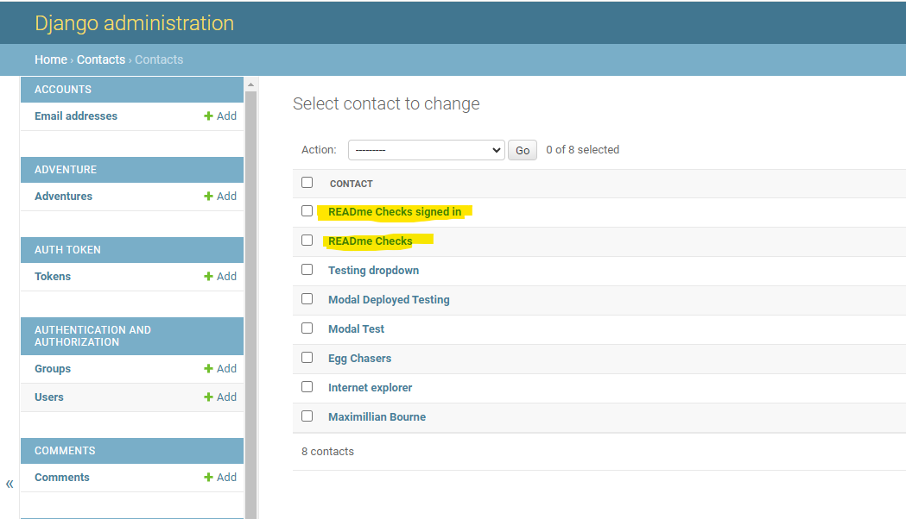
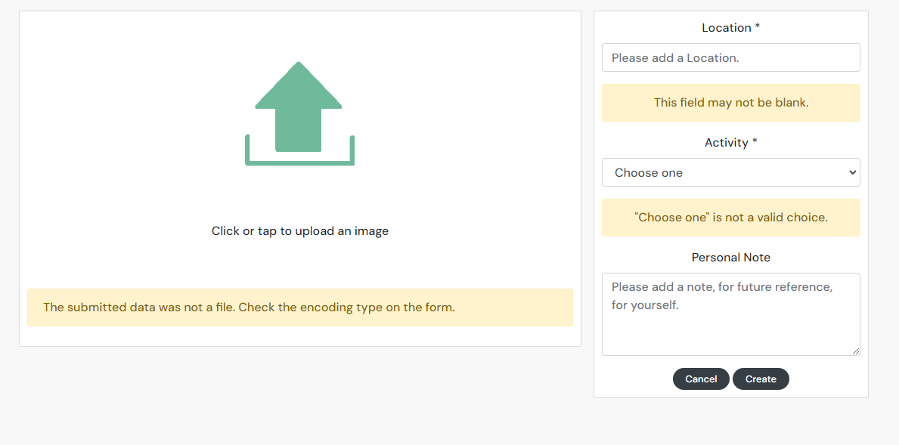
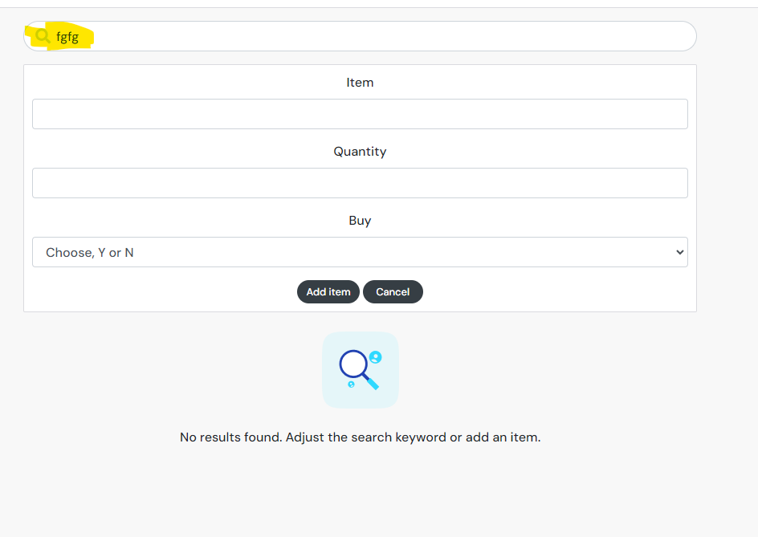
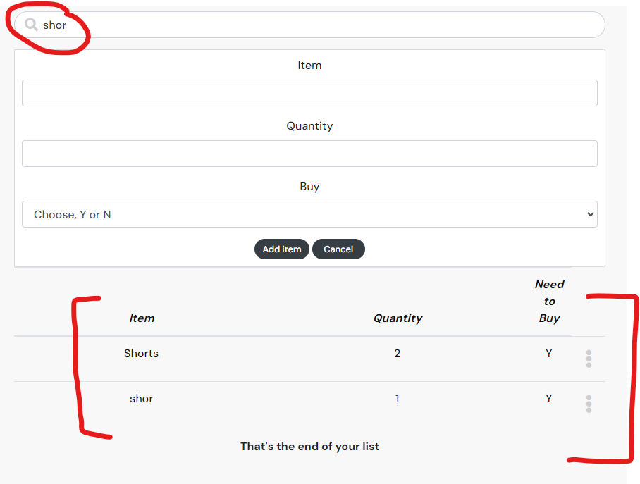
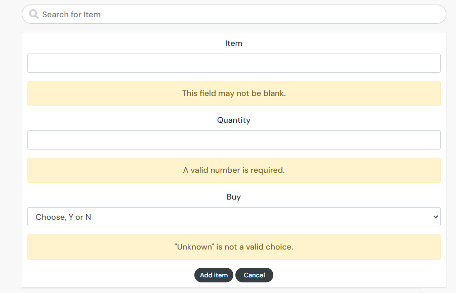

# Testing

Return back to the [README.md](README.md) file.

## Testing

Manual testing is where the creator of the code/site does quality checks/tests on the code, this is completed step by step. The purpose of tests is to catch any bugs or issues in the site before going live while to site is under development.

Automated testing is where code is used to test the logic, set of instructions to validate a feature or expected outcome of the code/feature.

## Validator Testing

# Manual Testing

**User Not Registered or Signed In**

- If there is no user logged in, the home page is showing with no Crate a post, My Adventure, Trip list.
- The user will be able to see a post entry but won't be able to add a comment.
- The user isn't able to edit or deleted a post unless it's a post that the user has created.
- The user can't see another users My Adventure or Trip list detials. 
- User can See Home, Sign in, Sign up and Contact Us.

## Checks Completed

- The following checks have been completed when there is no user signed in.
  
|Test|       Action                             |   Result                                                                  |Done   |
|----|------------------------------------------|---------------------------------------------------------------------------|-------|
| 1  |  Sign in clicked                         |  Redirected to login page                                                 | PASS  |
| 2  |  Sign up clicked                         |  Redirected to Sign up page                                               | PASS  |
| 3  |  Contact US	                            |  Redirected to Contact US page                                            | PASS  |
| 4  |  Live Life logo is Clicked	            |  Redirected to Blog home page from contact us/ Sign in and Sign up pages  | PASS  |

|Test|     Sign In  Page                        |   Result                                                                  |Done   |
|----|------------------------------------------|---------------------------------------------------------------------------|-------|
| 1  |  Valid info, submitted                   | Redirected to blog                                                        | PASS  |
| 2  |  Invalid info, submitted                 | Error message appears                                                     | PASS  |
| 3  |  Sign Up Now clicked                     | Redirected to Sign UP                                                     | PASS  |

|Test|     Sign Up page                         |   Result                                                                  |Done   |
|----|------------------------------------------|---------------------------------------------------------------------------|-------|
| 1  |  Valid info, submitted                   | Redirected to blog                                                        | PASS  |
| 2  |  Invalid info, submitted                 | Error message appears (password to common or to short, or don't match)    | PASS  |
| 3  |  Sign In Now clicked                     | Redirected to Sign In                                                     | PASS  |

|Test|     Contact US page                      |   Result                                                                  |Done   |
|----|------------------------------------------|---------------------------------------------------------------------------|-------|
| 1  |  Name not entered                        | Error message appears                                                     | PASS  |
| 2  |  Email not entered                       | Error message appears                                                     | PASS  |
| 3  |  Subject not entered                     | Error message appears                                                     | PASS  |
| 4  |  Message not entered                     | Error message appears                                                     | PASS  |
| 5  |  Email sent                              | Model window pops up, close is clicked                                    | PASS  |
| 6  |  Email sent and closed is clicked        | Redirected to home page                                                   | PASS  |
| 7  |  Django Admin checked                    | 

Email arrived with same info

                                              | PASS  |

|Test|     General site page                    |   Result                                                                  |Done   |
|----|------------------------------------------|---------------------------------------------------------------------------|-------|
| 1  |  Post image clicked                      | Post opens, No comment available                                          | PASS  |
| 2  |  Heart clicked                           | Error message appears to say to log in                                    | PASS  |
| 3  |  Comment icon clicked                    | Not login, can't comment                                                  | PASS  |

**User is Registered and Signed In**
- The following checks have been completed when a user is signed in.

|Test|     Sign Out                             |   Result                                                                  |Done   |
|----|------------------------------------------|---------------------------------------------------------------------------|-------|
| 1  |  Sign Out clicked                        | User is signed Out                                                        | PASS  |

|Test|     Add a Post                           |   Result                                                                  |Done   |
|----|------------------------------------------|---------------------------------------------------------------------------|-------|
| 1  |  Add a Post is clicked                   | Directed to create page                                                   | PASS  |
| 2  |  Create clicked with invalid info        | Error message appears for image                                           | PASS  |
| 3  |  Create clicked with valid info          | Directed to edit page                                                     | PASS  |

|Test|     My Adventure                         |   Result                                                                  |Done   |
|----|------------------------------------------|---------------------------------------------------------------------------|-------|
| 1  |  Search Bar ,Trip entered                | Only 1 adventure appears                                                  | PASS  |
| 2  |  Search Bar ,Family entered              | All family tags appear                                                    | PASS  |
| 3  |  Add an Adventure clicked                | Directed to create page                                                   | PASS  |
| 4  |  Cancel clicked on create page           | Directed back to Adventure page                                           | PASS  |
| 5  |  Create clicked with invalid info        | 

Error message appears for Image,Location and Activity

                     | PASS  |
| 6  |  Create clicked with valid info          | Directed to edit page                                                     | PASS  |

|Test|     Trip List                            |   Result                                                                  |Done   |
|----|------------------------------------------|---------------------------------------------------------------------------|-------|
| 1  |  Search Bar, items entered               | Returns item                                                              | PASS  |
| 2  |  Search Bar, incorrect entered           | 

Nothing returned item

                                                              | PASS  |
|Note*|  For testing for the search bar both Shorts and shor were items added for my trips list trip             |          |       |
| 3  |  shor entered into search Bar            | 

Shorts and Shor both returned items

                                       | PASS  |
| 4  |  Add Item clicked with invalid info      | 

Error message appears for Item,Quantity and Buy

                           | PASS  |
| 5  |  Only Item entered                       | Error message appears for Quantity and Buy                                | PASS  |
| 6  |  Only Quantity entered                   | Error message appears for Item and Buy                                    | PASS  |
| 7  |  Only Buy entered                        | Error message appears for Item and Quantity                               | PASS  |
| 8  |  Add Item clicked                        | Item appears button of the screen                                         | PASS  |

|Test|     Contact US page                      |   Result                                                                  |Done   |
|----|------------------------------------------|---------------------------------------------------------------------------|-------|
| 1  |  Name not entered                        | Error message appears for Email,Subject,Message                           | PASS  |
| 2  |  Email not entered                       | Error message appears for Name,Subject,Message                            | PASS  |
| 3  |  Subject not entered                     | Error message appears for Name,Email,Message                              | PASS  |
| 4  |  Message not entered                     | Error message appears for Name,Email,Subject                              | PASS  |
| 5  |  Email sent                              | Model window pops up, close is clicked                                    | PASS  |
| 6  |  Email sent and closed is clicked        | Redirected to home page                                                   | PASS  |
| 7  |  Django Admin checked                    | 

Email arrived with same info

                                              | PASS  |

|Test|     Liked page                           |   Result                                                                  |Done   |
|----|------------------------------------------|---------------------------------------------------------------------------|-------|
| 1  |  Liked only 1 post                       | Show only the 1  liked post                                               | PASS  |
| 2  |  Liked zero posts                        | Shows No results image                                                    | PASS  |
| 2  |  Liked own posts                         | Error message appears for can't like your own posts                       | PASS  |

|Test|     Following page                       |   Result                                                                  |Done   |
|----|------------------------------------------|---------------------------------------------------------------------------|-------|
| 1  |  Following only 1 profile                | Show only the 1 post from that profile                                    | PASS  |
| 2  |  Following zero profile                  | Shows No results image                                                    | PASS  |

|Test|                              |   Result                                                                  |Done   |
|----|------------------------------------------|---------------------------------------------------------------------------|-------|
| 1  |                 |                                                   | PASS  |
| 2  |                |                                                     | PASS  |
| 3  |                 |                                                    | PASS  |
| 4  |             |                                            | PASS  |
| 5  |          |                      | PASS  |
| 6  |            |                                                     | PASS  |

|Test|                              |   Result                                                                  |Done   |
|----|------------------------------------------|---------------------------------------------------------------------------|-------|
| 1  |                 |                                                   | PASS  |
| 2  |                |                                                     | PASS  |
| 3  |                 |                                                    | PASS  |
| 4  |             |                                            | PASS  |
| 5  |          |                      | PASS  |
| 6  |            |                                                     | PASS  |