# Testing

Return back to the [README.md](README.md) file.

# Table of Contents

- [Testing](#testing-1)
   * [Manual Testing](#manual-testing)
   * [Checks Completed](#checks-completed)
   * [ESLint JavaScript validator](#eslint-javascript-validator)
   * [CSS validator](#css-validator)
   * [Lighthouse & WAVE](#lighthouse-wave)
   * [Browser Compatibility](#browser-compatibility)
   * [Screen Size Tests](#screen-size-tests)

# Testing

Manual testing is where the creator of the code/site does quality checks/tests on the code, this is completed step by step. The purpose of tests is to catch any bugs or issues in the site before going live while the site is under development.

Automated testing is where code is used to test the logic, set of instructions to validate a feature or expected outcome of the code/feature.

## Manual Testing

**User Not Registered or Signed In**

- If there is no user logged in, the home page is showing with no Create a post, My Adventure, Trip list.
- The user will be able to see a post entry but won't be able to add a comment.
- The user isn't able to edit or delete a post unless it's a post that the user has created.
- The user can't see another users My Adventure or Trip list details. 
- User can See Home, Sign in, Sign up and Contact Us.

## Checks Completed

- The following checks have been completed when there is no user signed in.
- Console error checks were completed in Chrome / FireFox and Edge (abbreviated to CFE)*

  
|Test|       Action                             |   Result                                                                  |Passed |
|----|------------------------------------------|---------------------------------------------------------------------------|-------|
| 1  |  Landing page                            |  Page opens with no errors                                                |&#9745;|
| 2  |  Sign in clicked                         |  Redirected to login page                                                 |&#9745;|
| 3  |  Sign in clicked                         |  Page opens with no errors                                                |&#9745;|
| 4  |  Sign up clicked                         |  Redirected to Sign up page                                               |&#9745;|
| 5  |  Sign up clicked                         |  Page opens with no errors                                                |&#9745;|
| 6  |  Contact US	                            |  Redirected to Contact US page                                            |&#9745;|
| 7  |  Contact US	                            |  Page opens with no errors                                                |&#9745;|
| 8  |  Live Life logo is Clicked	            |  Redirected to Blog home page from contact us/ Sign in and Sign up pages  |&#9745;|
| 9  |  Live Life logo is Clicked	            |  Page opens with no errors                                                |&#9745;|

|Test|     Sign In  Page                        |   Result                                                                  |Passed |
|----|------------------------------------------|---------------------------------------------------------------------------|-------|
| 1  |  Valid info, submitted                   | Redirected to blog                                                        |&#9745;|
| 2  |  Invalid info, submitted                 | Error message appears                                                     |&#9745;|
| 3  |  Sign Up Now clicked                     | Redirected to Sign UP                                                     |&#9745;|
| 4  |  Console error checks in CFE             | 401 (Unauthorized) error, 

known issue
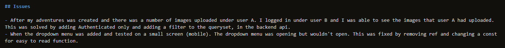
                                     |&#9745;|

|Test|     Sign Up page                         |   Result                                                                  |Passed |
|----|------------------------------------------|---------------------------------------------------------------------------|-------|
| 1  |  Valid info, submitted                   | Redirected to blog                                                        |&#9745;|
| 2  |  Invalid info, submitted                 | Error message appears (password to common or to short, or don't match)    |&#9745;|
| 3  |  Sign In Now clicked                     | Redirected to Sign In                                                     |&#9745;|
| 4  |  Console error checks in CFE             | 401 (Unauthorized) error, 

known issue

                                     |&#9745;|

|Test|     Contact US page                      |   Result                                                                  |Passed |
|----|------------------------------------------|---------------------------------------------------------------------------|-------|
| 1  |  Name not entered                        | Error message appears                                                     |&#9745;|
| 2  |  Email not entered                       | Error message appears                                                     |&#9745;|
| 3  |  Subject not entered                     | Error message appears                                                     |&#9745;|
| 4  |  Message not entered                     | Error message appears                                                     |&#9745;|
| 5  |  Email sent                              | Model window pops up, close is clicked                                    |&#9745;|
| 6  |  Email sent and closed is clicked        | Redirected to home page                                                   |&#9745;|
| 7  |  Django Admin checked                    | 

Email arrived with same info
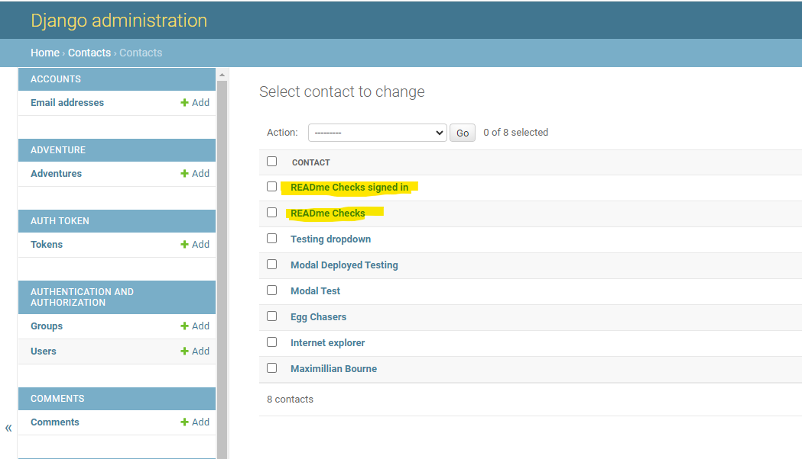
                                              |&#9745;|
| 4  |  Console error checks in CFE             | No Console errors displayed for Contact US checks                         |&#9745;|

|Test|     General site page                    |   Result                                                                  |Passed |
|----|------------------------------------------|---------------------------------------------------------------------------|-------|
| 1  |  Post image clicked                      | Post opens, No comment available                                          |&#9745;|
| 2  |  Heart clicked                           | Error message appears to say to log in                                    |&#9745;|
| 3  |  Comment icon clicked                    | Not login, can't comment                                                  |&#9745;|
| 4  |  Console error checks in CFE             | No Console errors displayed for Sign Out checks                           |&#9745;|
| 5  |  Edit posts                              | Can't edit posts if no user is logged in                                  |&#9745;|

**User is Registered and Signed In**
- The following checks have been completed when a user is signed in.

|Test|     Sign Out                             |   Result                                                                  |Passed |
|----|------------------------------------------|---------------------------------------------------------------------------|-------|
| 1  |  Sign Out clicked                        | User is signed Out                                                        |&#9745;|
| 2  |  Sign Out clicked                        |  Page opens with no errors                                                |&#9745;|
| 3  |  Console error checks in CFE             | No Console errors displayed for Sign Out checks                           |&#9745;|

|Test|     Add a Post                           |   Result                                                                  |Passed |
|----|------------------------------------------|---------------------------------------------------------------------------|-------|
| 1  |  Add a Post is clicked                   | Page opens with no errors, Directed to create page                        |&#9745;|
| 2  |  Create clicked with invalid info        | Error message appears for image                                           |&#9745;|
| 3  |  Create clicked with valid info          | Directed to edit page                                                     |&#9745;|
| 4  |  Console error checks in CFE             | No Console errors displayed for Add a Post checks                        |&#9745;|

|Test|     My Adventure                         |   Result                                                                  |Passed |
|----|------------------------------------------|---------------------------------------------------------------------------|-------|
| 1  |  My Adventure is clicked                 | Page opens with no errors, Directed to Adventure page                     |&#9745;|
| 2  |  Search Bar ,Trip entered                | Only 1 adventure appears                                                  |&#9745;|
| 3  |  Search Bar ,Family entered              | All family tags appear                                                    |&#9745;|
| 4  |  Add an Adventure clicked                | Directed to create page                                                   |&#9745;|
| 5  |  Cancel clicked on create page           | Directed back to Adventure page                                           |&#9745;|
| 6  |  Create clicked with invalid info        | 

Error message appears for Image, Location and Activity
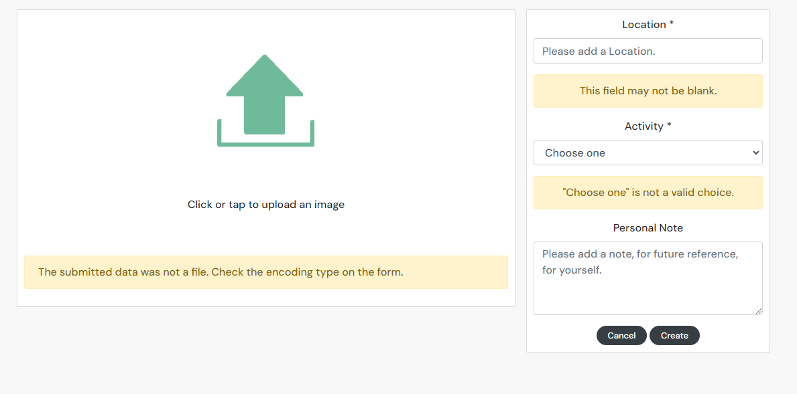
                    |&#9745;|
| 7  |  Create clicked with valid info          | Directed to edit page                                                     |&#9745;|
| 8  |  Console error checks in CFE             | No Console errors displayed for My Adventure checks                       |&#9745;|
| 9  |  Created adventure's under user A        | Logged in under user B and adventure's from user A aren't there           |&#9745;|

|Test|     Trip List                            |   Result                                                                  |Passed |
|----|------------------------------------------|---------------------------------------------------------------------------|-------|
| 1  |  Trip List is clicked                    | Page opens with no errors, Directed to Trip List page                     |&#9745;|
| 2  |  Search Bar, items entered               | Returns item                                                              |&#9745;|
| 3  |  Search Bar, incorrect entered           | 

Nothing returned item
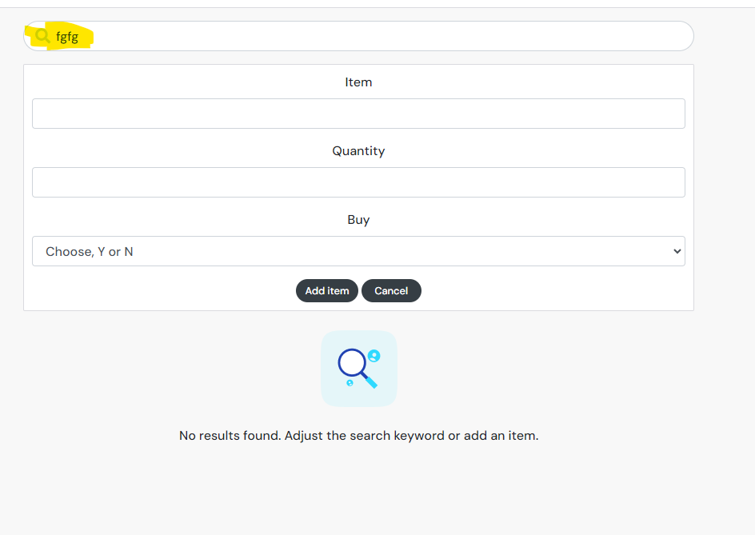
                                                              |&#9745;|
|Note*|  For testing for the search bar both Shorts and shor were items added for my trips list trip             |          |       |
| 4  |  shor entered into search Bar            | 

Shorts and Shor both returned items
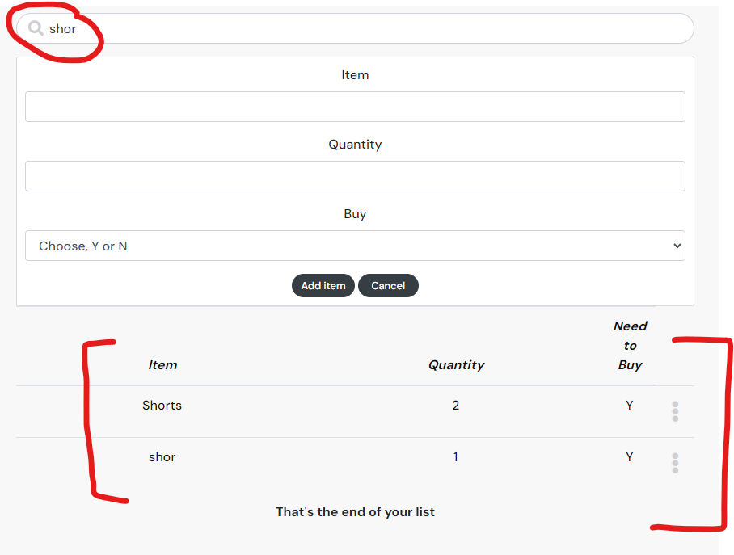
                                       |&#9745;|
| 5  |  Add Item clicked with invalid info      | 

Error message appears for Item, Quantity and Buy
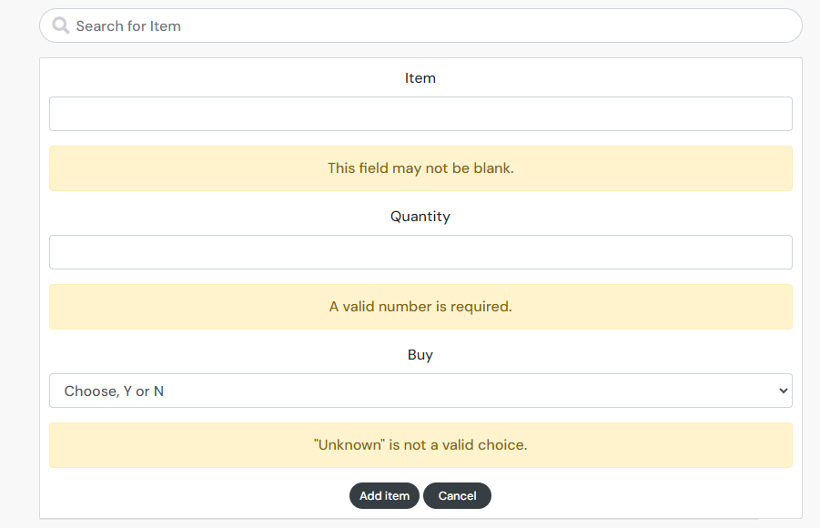
                          |&#9745;|
| 6  |  Only Item entered                       | 

Error message appears for Quantity and Buy
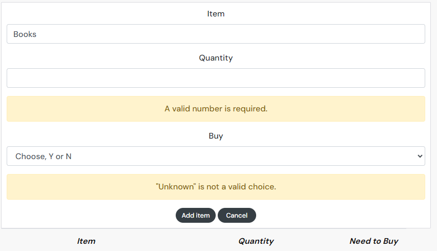
                                |&#9745;|
| 7  |  Only Quantity entered                   | Error message appears for Item and Buy                                    |&#9745;|
| 8  |  Only Buy entered                        | Error message appears for Item and Quantity                               |&#9745;|
| 9  |  Add Item clicked                        | Item appears button of the screen                                         |&#9745;|
| 10 |  Full List of items displayed            | All items created are displayed                                          |&#9745;|
| 11 |  Edit, item changed                      | Item updated                                                              |&#9745;|
| 12 |  Edit, Quantity changed                  | Quantity updated                                                          |&#9745;|
| 14 |  Edit, Need to Buy changed               | Need to Buy updated                                                       |&#9745;|
| 15 |  Console error checks in CFE             | No Console errors displayed for Trip List checks                          |&#9745;|
| 16 |  Django Admin checked                    | 

Item arrived with same info
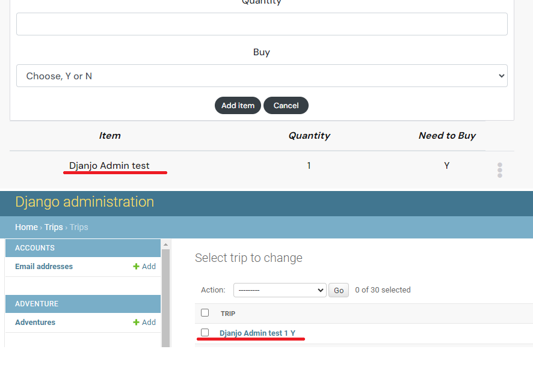
                                              |&#9745;|
| 17  |  Created Trip List under user A        | Logged in under user B and Trip List from user A aren't there              |&#9745;|

|Test|     Contact US page                      |   Result                                                                  |Passed |
|----|------------------------------------------|---------------------------------------------------------------------------|-------|
| 1  |  Contact US	                            | Redirected and Page opens with no errors                                  |&#9745;|
| 2  |  Name not entered                        | Error message appears for Email, Subject, Message                         |&#9745;|
| 3  |  Email not entered                       | Error message appears for Name, Subject, Message                          |&#9745;|
| 4  |  Subject not entered                     | Error message appears for Name, Email, Message                            |&#9745;|
| 5  |  Message not entered                     | Error message appears for Name, Email, Subject                            |&#9745;|
| 6  |  Email sent                              | Model window pops up, close is clicked                                    |&#9745;|
| 7  |  Email sent and closed is clicked        | Redirected to home page                                                   |&#9745;|
| 8  |  Django Admin checked                    | 

Email arrived with same info

                                              |&#9745;|
| 9  |  Console error checks in CFE             | 

No Console errors displayed for Contact us checks
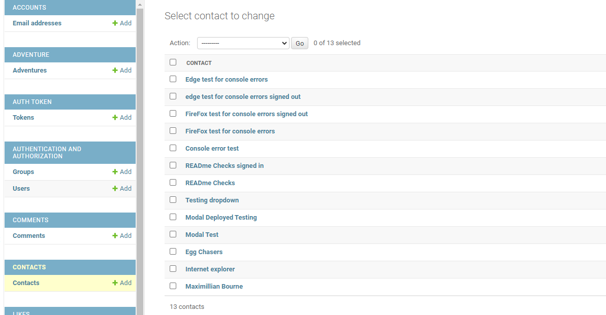
                         |&#9745;|

|Test|     Liked page                           |   Result                                                                  |Passed |
|----|------------------------------------------|---------------------------------------------------------------------------|-------|
| 1  |  Liked page is clicked                   | Redirected and page opens with no errors                                  |&#9745;|
| 2  |  Liked only 1 post                       | Show only the 1 liked post                                                |&#9745;|
| 3  |  Liked zero posts                        | Shows No results image                                                    |&#9745;|
| 4  |  Liked own posts                         | Error message appears for can't like your own posts                       |&#9745;|
| 5  |  Console error checks in CFE             | No Console errors displayed for Liked post checks                         |&#9745;|

|Test|     Following page                       |   Result                                                                  |Passed |
|----|------------------------------------------|---------------------------------------------------------------------------|-------|
| 1  |  Following page is clicked               | Redirected and page opens with no errors                                  |&#9745;|
| 2  |  Following only 1 profile                | Show only the 1 post from that profile                                    |&#9745;|
| 3  |  Following zero profile                  | Shows No results image                                                    |&#9745;|
| 4  |  Console error checks in CFE             | No Console errors displayed for Following post checks                     |&#9745;|

|Test|     Comments posts                       |   Result                                                                  |Passed |
|----|------------------------------------------|---------------------------------------------------------------------------|-------|
| 1  |  Comments add to post                    | Comment added beside post image                                           |&#9745;|
| 2  |  Comments deleted authenticated user     | When deleted, comment is removed from post                                |&#9745;|
| 3  |  Comments deleted unauthenticated user   | Can't deleted another users comment                                       |&#9745;|
| 4  |  Comments edit authenticated user        | Comment is edited correctly                                               |&#9745;|
| 5  |  Comments edit unauthenticated user      | Can't edited another users comment                                        |&#9745;|
| 6  |  Console error checks in CFE             | No Console errors displayed for Comments post checks                      |&#9745;|

|Test|     Edit posts                           |   Result                                                                  |Passed |
|----|------------------------------------------|---------------------------------------------------------------------------|-------|
| 1  |  Edit as authenticated user              | Title changed, post updated with correct edit info                        |&#9745;|
| 2  |  Edit as unauthenticated user            | Can't edit another users posts                                            |&#9745;|
| 3  |  Delete as authenticated user            | Post is deleted                                                           |&#9745;|
| 4  |  Delete as unauthenticated user          | Can't deleted another users posts                                         |&#9745;|
| 5  |  Console error checks in CFE             | No Console errors displayed for Edit post checks                          |&#9745;|

|Test|     Edit Profile                         |   Result                                                                  |Passed |
|----|------------------------------------------|---------------------------------------------------------------------------|-------|
| 1  |  Change Image                            | 

Image changed with no issues
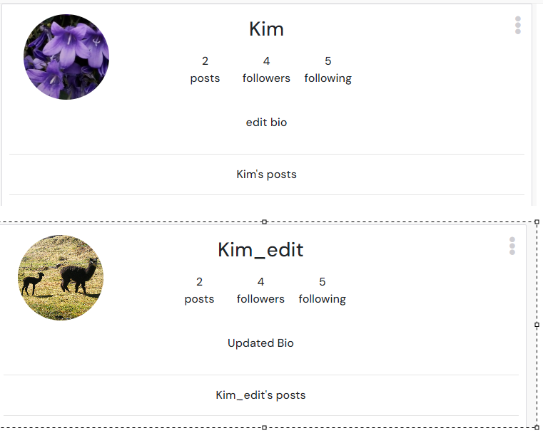
                                              |&#9745;|
| 2  |  Edit bio                                | 

Added and changed bio with no issues

                                      |&#9745;|
| 3  |  Changed username                        | 

Username changed with no issues

                                           |&#9745;|
| 4  |  Changed password                        | Password changed with no issues                                           |&#9745;|
| 5  |  Console error checks in CFE             | No Console errors displayed for Profile checks                            |&#9745;|

## Django Aministration

- Admin was tested to see if Trip List, Adventure's, Post, Comments and Contacts were visible.
[Django administration](https://live-life-api-now-f6f9c42b2398.herokuapp.com/admin/)

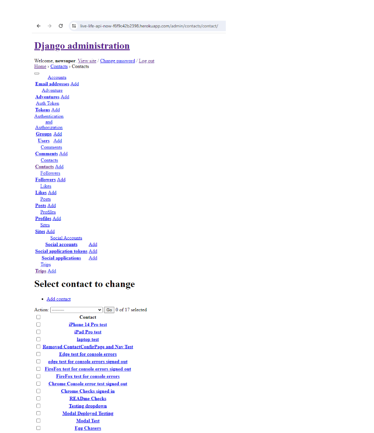

## ESLint JavaScript validator

All JavaScript files were validated using the [ESLint JavaScript validator](https://jshint.com/).

- There are a number of warnings for 'import' is only available in ES6 (use 'esversion: 6'), [ES6 Fix stackoverflow](https://stackoverflow.com/questions/36318895/vs-code-with-es6).

- `Adventure.js`: no errors found
- `AdventureCreateForm.js`: no errors found
- `AdventureEditForm.js`: no errors found
- `AdventurePage.js`: no errors found
- `AdventuresPage.js`: no errors found
- `TripListCreateForm.js`: no errors found
- `TripPage.js`: no errors found
- `PopularProfiles.js`: no errors found
- `Profile.js`: no errors found
- `ProfileEditForm.js`: no errors found
- `ProfilePage.js`: no errors found
- `UserPasswordForm.js`: no errors found
- `UsernameForm.js`: no errors found
- `Post.js`: no errors found
- `PostCreateForm.js`: no errors found
- `PostEditForm.js`: no errors found
- `PostPage.js`: no errors found
- `PostsPage.js`: no errors found
- `ContactCreateForm.js`: no errors found
- `Comment.js`: no errors found
- `CommentCreateForm.js`: no errors found
- `CommentEditForm.js`: no errors found
- `SignInForm.js`: no errors found
- `SignUpForm.js`: no errors found
- `handlers.js`: no errors found
- `useRedirect.js`: no errors found
- `useClickOutsideToggle.js`: no errors found
- `ProfileDataContext.js`: no errors found
- `CurrentUserContext.js`: no errors found
- `NotFound.js`: no errors found
- `NavBar.js`: no errors found
- `MoreDropdown.js`: no errors found
- `Avatar.js`: no errors found
- `Asset.js`: no errors found
- `AdventureCard.js`: no errors found
- `App.js`: no errors found

## CSS validator

- `Adventure.module.css`: no errors found
- `AdventureCreateEditForm.module.css`: no errors found
- `AdventureImage.module.css`: no errors found
- `Asset.module.css`: no errors found
- `Avatar.module.css`: no errors found
- `Button.module.css`: no errors found
- `Cards.module.css`: no errors found
- `Comment.module.css`: no errors found
- `CommentCreateEditForm.module.css`: no errors found
- `ContactCreateForm.module.css`: no errors found
- `MoreDropdown.module.css`: no errors found
- `NavBar.module.css`: no errors found
- `NotFound.module.css`: no errors found
- `Post.module.css`: no errors found
- `PostCreateEditForm.module.css`: no errors found
- `PostsPage.module.css`: no errors found
- `Profile.module.css`: no errors found
- `ProfilePage.module.css`: no errors found
- `SignInUpForm.module.css`: no errors found
- `TripsPage.module.css`: no errors found

## Lighthouse & WAVE

- Performance due to image size and extension for posts and profiles, when uploaded by Users, was around the 70-80%. With no images the Performance was above 90%
- Best Practices was down to third part cookies, [Dev tools 3rd party cookies](https://developer.chrome.com/blog/new-in-devtools-122/?utm_source=devtools), and the phaseout warnings in network [tracking protection](https://blog.google/products/chrome/privacy-sandbox-tracking-protection/). Chrome is testing Tracking Protection, a new feature that limits cross-site tracking.

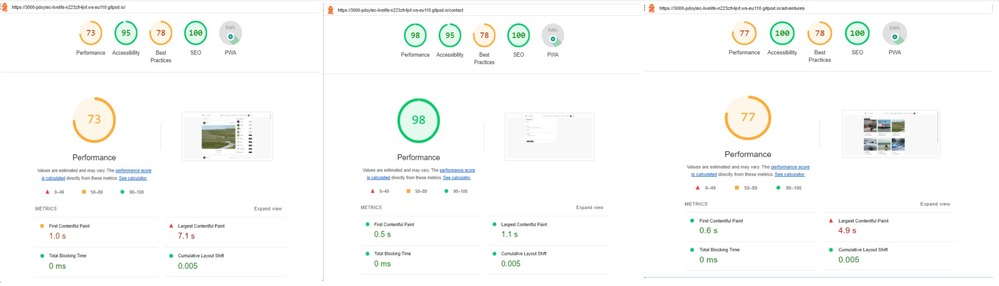
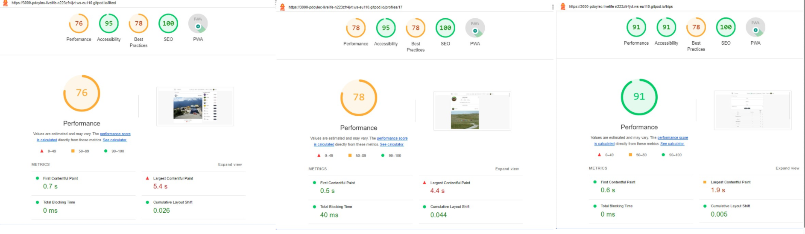

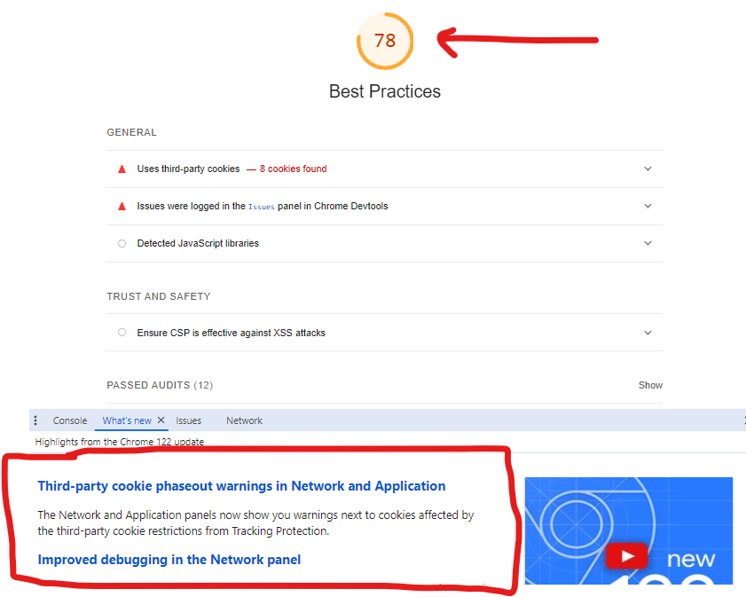

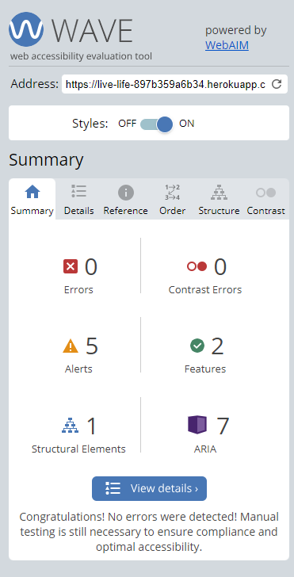

## Browser Compatibility
This website was tested on Chrome, Firefox and Microsoft Edge.

## Screen Size Tests

- Testing was carried out on small screen sizes.
- iPhone 14 Pro.
- iPad Pro.

- iPad Pro, Screen Shots.

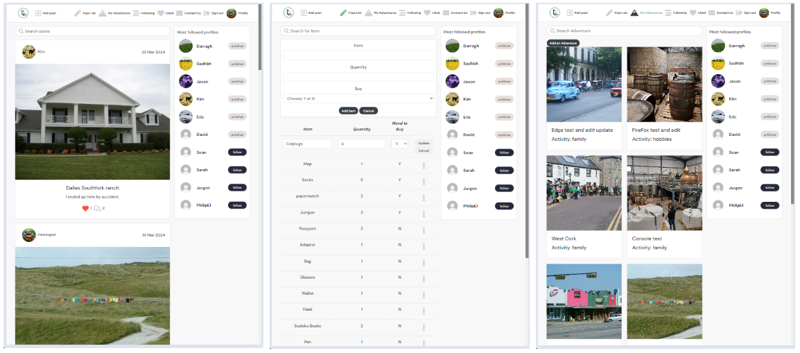
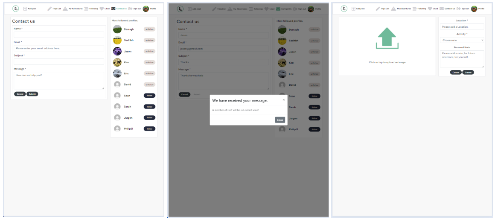

- iPhone 14 Pro, Screen Shots.

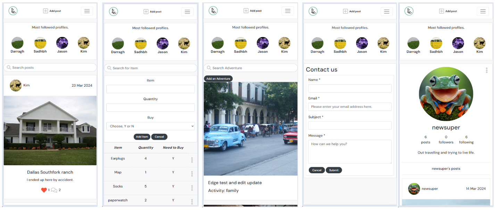
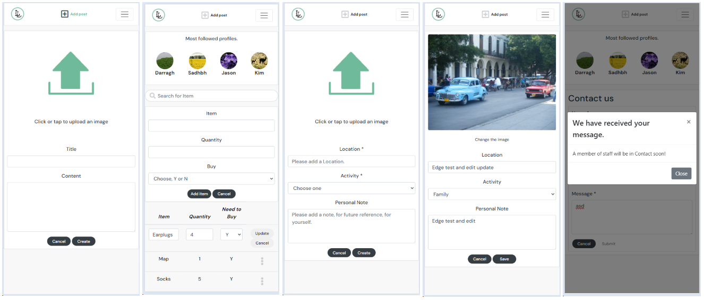

